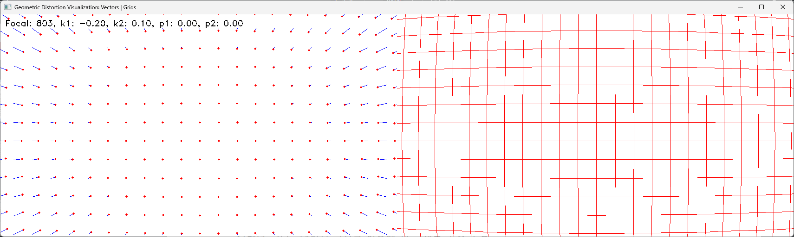

# Camera Calibration
 Camera Calibration using OpenCV
 ## Camera Calibration Results
* The number of selected images = 14
* RMS error = 0.7056903486514047
* Camera matrix (K) =
[[803.23665479   0.         429.96989197]
 [  0.         808.90217625 273.55823251]
 [  0.           0.           1.        ]]
* Distortion coefficient (k1, k2, p1, p2, k3, ...) = [ 0.13647651  0.00318341  0.00799494  0.00173716 -1.33621083]

## Distortion Correction Result

